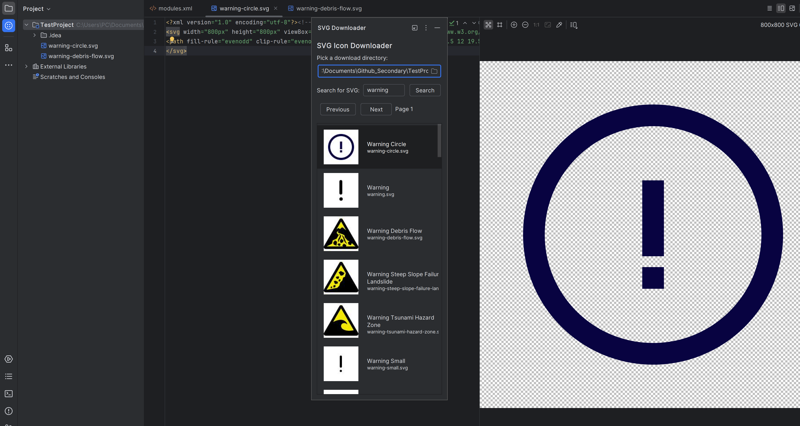

# SVG Icon Downloader

<!-- Plugin description -->
A plugin for JetBrains IDEs that finds and downloads SVG icons from svgrepo.com directly from your IDE.

Key features:
- Search and browse SVG icons from svgrepo.com without leaving your IDE
- Download icons with a single click
- Preview icons before downloading
- Choose a download directory inside your project

<!-- Plugin description end -->

## Installation

- Install the plugin from the [JetBrains Marketplace](https://plugins.jetbrains.com/plugin/your-plugin-id)

## Example Usage

## License

This project is licensed under the MIT License 

[LICENSE](LICENSE)
